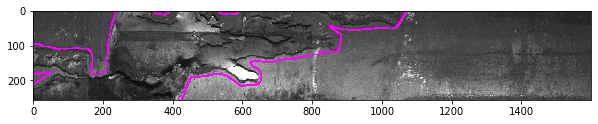
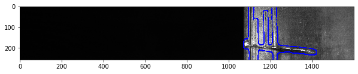
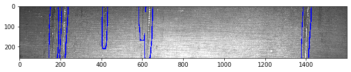
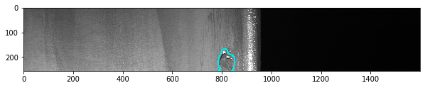
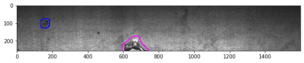
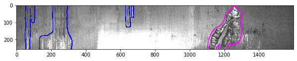
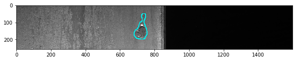
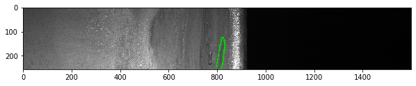

# steel_seg

This project contains my solution to Kaggle's [Severstal: Steel Defect Detection](https://www.kaggle.com/c/severstal-steel-defect-detection)  challenge. This solution placed 293rd in a dense leaderbord of 2431 teams (Mean Dice Coeff. of 0.897 vs. winning score of 0.909).

## Sample Model Segmentations










## Getting Started

```
# Build and run docker container workspace.
docker pull nvcr.io/nvidia/tensorflow:19.09-py3
docker build -t steel_seg .
docker run --gpus all -it --rm --shm-size=1g --ulimit memlock=-1 --ulimit stack=67108864 -v /home/ryan/src/steel_seg:/src/steel_seg -p 8888:8888 -p 6006:6006 steel_seg

# Training scripts are in jupyter notebooks.
# From container, run:
cd /src/steel_seg
jupyter notebook
```

## Kaggle Competition Learnings

I participated in this competition first and foremost as a learning opportunity. Here were some of my key takeaways from the project:
- Prioritize tools for EDA and model interpretability / evaluation. These tools promote principaled experimentation rather than falling into a situation where you are trying to *guess* why your model is underperforming.
- Learn as much as you can about the data. For example, in this competition, there were clusters of similar images in the public training dataset that did not appear in the test set. Unfortuantely, I did not notice this until after the competition ended.
- Stick with off-the-shelf pretrained models at the start. This will serve as an excellent baseline, and may be difficult to beat with a custom model given a limited dataset size and limited compute resources.
